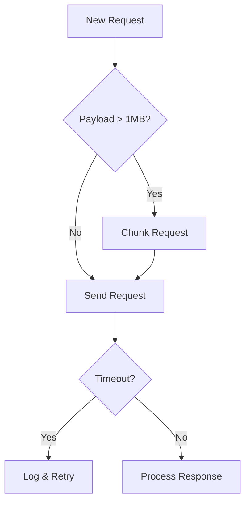

# Error Handling Guide

## Network Errors
### `protocol error: incomplete envelope: unexpected EOF`
**Description:**  
Indicates incomplete data transmission during API requests, typically caused by:
- Network interruptions
- Request timeouts
- Malformed payloads
- API version mismatches

**Symptoms:**
1. Intermittent failures during large operations
2. Errors correlate with payload size
3. Random occurrence across different API endpoints
4. No clear pattern in failure timing

**Troubleshooting Steps:**
1. **Check Network Monitor**  
   Review [network monitoring logs](cci:7://file:///C:/Users/bjorn.hansen/Documents/sem-ads-operations/src/utils/network-monitoring.ts):
   ```typescript
   const monitor = NetworkMonitor.getInstance();
   const stats = monitor.getRequestStats(failedRequestId);
   ```
2. **Verify Timeout Settings**
   - Check if operation duration exceeds timeout
   - Review timeout configuration in [rate limiter](cci:7://file:///C:/Users/bjorn.hansen/Documents/sem-ads-operations/src/lib/rate-limiter.ts)
3. **Validate Payload**
   - Use [validateGoogleAdsPayload](cci:7://file:///C:/Users/bjorn.hansen/Documents/sem-ads-operations/src/utils/api-diagnostics.ts)
   - Check for circular references
   - Verify JSON serialization
4. **Review API Version**
   Confirm endpoint URL matches current API version:
   ```typescript
   // Incorrect
   'https://googleads.googleapis.com/v14/customers/...'
   // Correct (v15)
   'https://googleads.googleapis.com/v15/customers/...'
   ```
5. **Test Connectivity**
   ```bash
   curl -I https://googleads.googleapis.com/v15/customers
   ```

**Resolution Steps:**
1. Increase timeout duration
2. Implement request chunking
3. Add retry with exponential backoff
4. Verify API version consistency
5. Update network monitoring configuration

**Prevention Strategies:**


**Related Files:**
1. [Network Monitoring](cci:7://file:///C:/Users/bjorn.hansen/Documents/sem-ads-operations/src/utils/network-monitoring.ts)
2. [API Diagnostics](cci:7://file:///C:/Users/bjorn.hansen/Documents/sem-ads-operations/src/utils/api-diagnostics.ts)
3. [Project Log](cci:7://file:///C:/Users/bjorn.hansen/Documents/sem-ads-operations/documentation/project-logs/2025-03-04-campaign-copy-error-investigation.md)

## API Errors
{{ ... }}

## Validation Errors
{{ ... }}
